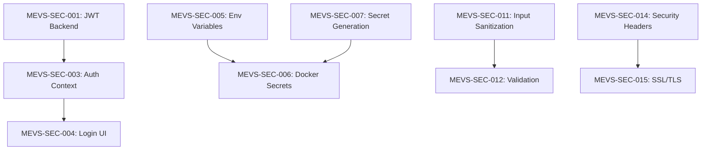

# 🎫 MEV Shield Security Remediation Tickets

**Project**: MEV Shield Security Hardening  
**Created**: 2025-09-18  
**Priority**: CRITICAL - Production Blocking  
**Total Tickets**: 45  
**Estimated Timeline**: 8 weeks

---

## 🔴 PHASE 1: CRITICAL REMEDIATION (Week 1-2)
*Production deployment blocked until complete*

### Authentication System Implementation

#### MEVS-SEC-001: JWT Authentication Backend Implementation
**Type**: Feature / Security  
**Priority**: 🔴 Critical  
**Estimated Time**: 3 days  
**Assignee**: Backend Team  
**Blocker**: Yes - Production

**Description**: Implement JWT-based authentication system for API endpoints

**Acceptance Criteria**:
- [ ] JWT token generation with 24-hour expiry
- [ ] Token validation middleware implemented
- [ ] Refresh token mechanism in place
- [ ] Token blacklist for logout functionality
- [ ] Rate limiting on authentication endpoints

**Technical Requirements**:
```rust
// Dependencies to add
jsonwebtoken = "8.3"
uuid = { version = "1.0", features = ["v4"] }
chrono = { version = "0.4", features = ["serde"] }
```

**Testing Requirements**:
- Unit tests for token generation/validation
- Integration tests for protected endpoints
- Load testing for authentication endpoints

---

#### MEVS-SEC-002: Password Hashing Implementation
**Type**: Security  
**Priority**: 🔴 Critical  
**Estimated Time**: 1 day  
**Assignee**: Backend Team  
**Blocker**: Yes - Production

**Description**: Implement Argon2 password hashing for user credentials

**Acceptance Criteria**:
- [ ] Argon2id algorithm implemented
- [ ] Password strength validation (min 12 chars)
- [ ] Password history tracking (prevent reuse)
- [ ] Secure password reset flow
- [ ] Migration script for existing passwords

**Technical Requirements**:
```rust
argon2 = "0.5"
// Memory cost: 65536 KB
// Time cost: 2 iterations
// Parallelism: 1
```

---

#### MEVS-SEC-003: Frontend Authentication Context
**Type**: Feature  
**Priority**: 🔴 Critical  
**Estimated Time**: 2 days  
**Assignee**: Frontend Team  
**Dependencies**: MEVS-SEC-001

**Description**: Implement React authentication context and protected routes

**Acceptance Criteria**:
- [ ] AuthContext with login/logout functionality
- [ ] Protected route wrapper component
- [ ] Token persistence in secure storage
- [ ] Automatic token refresh
- [ ] Session timeout handling

**Components**:
- `src/auth/AuthContext.tsx`
- `src/auth/ProtectedRoute.tsx`
- `src/auth/useAuth.hook.ts`

---

#### MEVS-SEC-004: Login/Registration UI
**Type**: Feature  
**Priority**: 🔴 Critical  
**Estimated Time**: 2 days  
**Assignee**: Frontend Team  
**Dependencies**: MEVS-SEC-003

**Description**: Create secure login and registration interfaces

**Acceptance Criteria**:
- [ ] Login form with validation
- [ ] Registration form with password requirements
- [ ] Two-factor authentication support
- [ ] Remember me functionality (secure)
- [ ] Password strength indicator

---

### Secure Credential Management

#### MEVS-SEC-005: Environment Variable Security
**Type**: Security  
**Priority**: 🔴 Critical  
**Estimated Time**: 1 day  
**Assignee**: DevOps Team  
**Blocker**: Yes - Production

**Description**: Restructure environment variables for security

**Acceptance Criteria**:
- [ ] `.env.template` created with all variables
- [ ] Separate configs for dev/staging/prod
- [ ] No hardcoded secrets in codebase
- [ ] Documentation for secret rotation
- [ ] Validation script for env variables

**Files to Create**:
- `.env.template`
- `.env.development`
- `.env.production.example`

---

#### MEVS-SEC-006: Docker Secrets Implementation
**Type**: Infrastructure  
**Priority**: 🔴 Critical  
**Estimated Time**: 2 days  
**Assignee**: DevOps Team  
**Blocker**: Yes - Production

**Description**: Implement Docker secrets for sensitive data

**Acceptance Criteria**:
- [ ] Docker secrets configured for all passwords
- [ ] Secrets mounted as files, not env vars
- [ ] Secret rotation mechanism
- [ ] Backup and recovery procedures
- [ ] Access control on secret files

**Configuration Files**:
- `docker-compose.secrets.yml`
- `scripts/rotate-secrets.sh`

---

#### MEVS-SEC-007: Secret Generation Automation
**Type**: Tool  
**Priority**: 🔴 Critical  
**Estimated Time**: 1 day  
**Assignee**: DevOps Team  
**Blocker**: Yes - Production

**Description**: Automate secure secret generation

**Acceptance Criteria**:
- [ ] Script generates cryptographically secure secrets
- [ ] Different secret strengths for different uses
- [ ] Secrets stored with correct permissions (600)
- [ ] Backup mechanism included
- [ ] Integration with CI/CD pipeline

---

### Docker Security Hardening

#### MEVS-SEC-008: Non-Root Container Implementation
**Type**: Security  
**Priority**: 🔴 Critical  
**Estimated Time**: 2 days  
**Assignee**: DevOps Team  
**Blocker**: Yes - Production

**Description**: Configure all containers to run as non-root users

**Acceptance Criteria**:
- [ ] All Dockerfiles use non-root users
- [ ] Proper file permissions set
- [ ] No privilege escalation possible
- [ ] Health checks work with non-root
- [ ] Logging works with non-root

---

#### MEVS-SEC-009: Container Security Constraints
**Type**: Security  
**Priority**: 🔴 Critical  
**Estimated Time**: 1 day  
**Assignee**: DevOps Team  
**Blocker**: Yes - Production

**Description**: Apply security constraints to all containers

**Acceptance Criteria**:
- [ ] `no-new-privileges` flag enabled
- [ ] Capabilities dropped (except required)
- [ ] Read-only root filesystem
- [ ] Security profiles applied
- [ ] Resource limits configured

**Security Options**:
```yaml
security_opt:
  - no-new-privileges:true
  - apparmor:docker-default
cap_drop:
  - ALL
cap_add:
  - NET_BIND_SERVICE
```

---

#### MEVS-SEC-010: Container Vulnerability Scanning
**Type**: Security  
**Priority**: 🔴 Critical  
**Estimated Time**: 1 day  
**Assignee**: DevOps Team  
**Blocker**: Yes - Production

**Description**: Implement automated container vulnerability scanning

**Acceptance Criteria**:
- [ ] Trivy scanner integrated
- [ ] Scan on every build
- [ ] Block deployment if critical vulnerabilities
- [ ] Regular base image updates
- [ ] Vulnerability reports generated

---

## 🟠 PHASE 2: HIGH PRIORITY (Week 3-4)

### Input Validation and XSS Prevention

#### MEVS-SEC-011: Frontend Input Sanitization
**Type**: Security  
**Priority**: 🟠 High  
**Estimated Time**: 2 days  
**Assignee**: Frontend Team

**Description**: Implement DOMPurify for XSS prevention

**Acceptance Criteria**:
- [ ] DOMPurify integrated in all user inputs
- [ ] Custom sanitization rules defined
- [ ] HTML content properly escaped
- [ ] Rich text editor security configured
- [ ] Unit tests for sanitization

**Implementation**:
```typescript
npm install dompurify @types/dompurify
```

---

#### MEVS-SEC-012: Backend Input Validation
**Type**: Security  
**Priority**: 🟠 High  
**Estimated Time**: 3 days  
**Assignee**: Backend Team

**Description**: Implement comprehensive input validation on API

**Acceptance Criteria**:
- [ ] Validation schemas for all endpoints
- [ ] Ethereum address validation
- [ ] Amount/number validation
- [ ] String length limits
- [ ] SQL injection prevention

---

#### MEVS-SEC-013: File Upload Security
**Type**: Security  
**Priority**: 🟠 High  
**Estimated Time**: 2 days  
**Assignee**: Backend Team

**Description**: Secure file upload handling

**Acceptance Criteria**:
- [ ] File type validation
- [ ] File size limits
- [ ] Virus scanning integration
- [ ] Secure file storage location
- [ ] File name sanitization

---

### Network Security Hardening

#### MEVS-SEC-014: Nginx Security Headers
**Type**: Security  
**Priority**: 🟠 High  
**Estimated Time**: 1 day  
**Assignee**: DevOps Team

**Description**: Implement comprehensive security headers

**Acceptance Criteria**:
- [ ] CSP header configured
- [ ] HSTS enabled with preload
- [ ] X-Frame-Options set to DENY
- [ ] X-Content-Type-Options nosniff
- [ ] Referrer-Policy configured

---

#### MEVS-SEC-015: SSL/TLS Configuration
**Type**: Security  
**Priority**: 🟠 High  
**Estimated Time**: 2 days  
**Assignee**: DevOps Team

**Description**: Implement strong TLS configuration

**Acceptance Criteria**:
- [ ] TLS 1.2/1.3 only
- [ ] Strong cipher suites only
- [ ] Certificate automation with Let's Encrypt
- [ ] OCSP stapling enabled
- [ ] SSL Labs A+ rating achieved

---

#### MEVS-SEC-016: Rate Limiting Implementation
**Type**: Security  
**Priority**: 🟠 High  
**Estimated Time**: 2 days  
**Assignee**: Backend Team

**Description**: Implement API rate limiting

**Acceptance Criteria**:
- [ ] Per-user rate limits
- [ ] Per-IP rate limits
- [ ] Different limits for different endpoints
- [ ] Rate limit headers in responses
- [ ] DDoS protection configured

---

#### MEVS-SEC-017: Database Network Isolation
**Type**: Infrastructure  
**Priority**: 🟠 High  
**Estimated Time**: 1 day  
**Assignee**: DevOps Team

**Description**: Isolate database from external network

**Acceptance Criteria**:
- [ ] Databases on internal network only
- [ ] No external port exposure
- [ ] Access through application only
- [ ] Network policies configured
- [ ] Connection encryption enabled

---

### CORS Security Implementation

#### MEVS-SEC-018: Restrictive CORS Policy
**Type**: Security  
**Priority**: 🟠 High  
**Estimated Time**: 1 day  
**Assignee**: Backend Team

**Description**: Implement restrictive CORS configuration

**Acceptance Criteria**:
- [ ] Whitelist specific origins only
- [ ] Credentials support configured properly
- [ ] Preflight caching configured
- [ ] Methods restricted to required only
- [ ] Headers restricted to required only

---

#### MEVS-SEC-019: API Gateway Security
**Type**: Security  
**Priority**: 🟠 High  
**Estimated Time**: 2 days  
**Assignee**: DevOps Team

**Description**: Implement API gateway with security features

**Acceptance Criteria**:
- [ ] API versioning implemented
- [ ] Request/response validation
- [ ] API key management
- [ ] Throttling configured
- [ ] Logging and monitoring

---

## 🟡 PHASE 3: MEDIUM PRIORITY (Month 2)

### Monitoring and Alerting

#### MEVS-SEC-020: Security Metrics Collection
**Type**: Monitoring  
**Priority**: 🟡 Medium  
**Estimated Time**: 3 days  
**Assignee**: DevOps Team

**Description**: Implement security metrics collection

**Acceptance Criteria**:
- [ ] Failed login attempts tracked
- [ ] API error rates monitored
- [ ] Response time metrics
- [ ] Resource usage tracking
- [ ] Custom security metrics defined

---

#### MEVS-SEC-021: Alert Rules Configuration
**Type**: Monitoring  
**Priority**: 🟡 Medium  
**Estimated Time**: 2 days  
**Assignee**: DevOps Team

**Description**: Configure security alert rules

**Acceptance Criteria**:
- [ ] High failed login rate alerts
- [ ] Unauthorized access alerts
- [ ] Anomalous traffic alerts
- [ ] Resource exhaustion alerts
- [ ] Alert routing configured

---

#### MEVS-SEC-022: Security Dashboard
**Type**: Feature  
**Priority**: 🟡 Medium  
**Estimated Time**: 3 days  
**Assignee**: Frontend Team

**Description**: Create security monitoring dashboard

**Acceptance Criteria**:
- [ ] Real-time security metrics
- [ ] Historical trend analysis
- [ ] Alert management interface
- [ ] Incident tracking
- [ ] Report generation

---

#### MEVS-SEC-023: Log Aggregation System
**Type**: Infrastructure  
**Priority**: 🟡 Medium  
**Estimated Time**: 3 days  
**Assignee**: DevOps Team

**Description**: Implement centralized log aggregation

**Acceptance Criteria**:
- [ ] All logs collected centrally
- [ ] Log retention policies
- [ ] Log search capabilities
- [ ] Sensitive data redaction
- [ ] Audit log integrity

---

### Compliance Documentation

#### MEVS-SEC-024: Data Protection Impact Assessment
**Type**: Documentation  
**Priority**: 🟡 Medium  
**Estimated Time**: 2 days  
**Assignee**: Compliance Team

**Description**: Create DPIA documentation

**Acceptance Criteria**:
- [ ] Data inventory completed
- [ ] Processing activities documented
- [ ] Legal basis identified
- [ ] Risk assessment completed
- [ ] Mitigation measures documented

---

#### MEVS-SEC-025: Privacy Policy Implementation
**Type**: Documentation  
**Priority**: 🟡 Medium  
**Estimated Time**: 2 days  
**Assignee**: Legal Team

**Description**: Create and implement privacy policy

**Acceptance Criteria**:
- [ ] Privacy policy drafted
- [ ] Cookie policy included
- [ ] User consent mechanisms
- [ ] Data retention policies
- [ ] User rights procedures

---

#### MEVS-SEC-026: Audit Trail Implementation
**Type**: Feature  
**Priority**: 🟡 Medium  
**Estimated Time**: 3 days  
**Assignee**: Backend Team

**Description**: Implement comprehensive audit logging

**Acceptance Criteria**:
- [ ] All critical actions logged
- [ ] Immutable audit logs
- [ ] User attribution
- [ ] Timestamp accuracy
- [ ] Log retention compliance

---

#### MEVS-SEC-027: Compliance Reporting System
**Type**: Feature  
**Priority**: 🟡 Medium  
**Estimated Time**: 2 days  
**Assignee**: Backend Team

**Description**: Automated compliance reporting

**Acceptance Criteria**:
- [ ] GDPR compliance reports
- [ ] Security compliance reports
- [ ] Automated report generation
- [ ] Export capabilities
- [ ] Scheduled reporting

---

### Secrets Management System

#### MEVS-SEC-028: HashiCorp Vault Integration
**Type**: Infrastructure  
**Priority**: 🟡 Medium  
**Estimated Time**: 4 days  
**Assignee**: DevOps Team

**Description**: Integrate HashiCorp Vault for secrets

**Acceptance Criteria**:
- [ ] Vault server deployed
- [ ] Application integration completed
- [ ] Secret rotation automated
- [ ] Access policies configured
- [ ] Audit logging enabled

---

#### MEVS-SEC-029: Key Management System
**Type**: Security  
**Priority**: 🟡 Medium  
**Estimated Time**: 3 days  
**Assignee**: Backend Team

**Description**: Implement encryption key management

**Acceptance Criteria**:
- [ ] Key generation automated
- [ ] Key rotation scheduled
- [ ] Key escrow implemented
- [ ] Hardware security module support
- [ ] Key usage auditing

---

#### MEVS-SEC-030: Certificate Management
**Type**: Infrastructure  
**Priority**: 🟡 Medium  
**Estimated Time**: 2 days  
**Assignee**: DevOps Team

**Description**: Automated certificate management

**Acceptance Criteria**:
- [ ] Certificate auto-renewal
- [ ] Certificate monitoring
- [ ] Expiry alerts configured
- [ ] Certificate pinning
- [ ] Wildcard certificate support

---

## 🟢 PHASE 4: ONGOING MAINTENANCE

### Automated Security Scanning

#### MEVS-SEC-031: CI/CD Security Integration
**Type**: Infrastructure  
**Priority**: 🟢 Low  
**Estimated Time**: 3 days  
**Assignee**: DevOps Team

**Description**: Integrate security scanning in CI/CD

**Acceptance Criteria**:
- [ ] SAST scanning on every commit
- [ ] DAST scanning on deployments
- [ ] Dependency scanning automated
- [ ] Container scanning in pipeline
- [ ] Security gates configured

---

#### MEVS-SEC-032: Vulnerability Management System
**Type**: Process  
**Priority**: 🟢 Low  
**Estimated Time**: 2 days  
**Assignee**: Security Team

**Description**: Implement vulnerability management process

**Acceptance Criteria**:
- [ ] Vulnerability database maintained
- [ ] Patch management process
- [ ] Risk scoring system
- [ ] Remediation tracking
- [ ] Metrics and reporting

---

#### MEVS-SEC-033: Penetration Testing Program
**Type**: Process  
**Priority**: 🟢 Low  
**Estimated Time**: Ongoing  
**Assignee**: Security Team

**Description**: Regular penetration testing

**Acceptance Criteria**:
- [ ] Quarterly pen tests scheduled
- [ ] External vendor selected
- [ ] Remediation tracking
- [ ] Retest procedures
- [ ] Executive reporting

---

### Security Training Program

#### MEVS-SEC-034: Developer Security Training
**Type**: Training  
**Priority**: 🟢 Low  
**Estimated Time**: Ongoing  
**Assignee**: All Teams

**Description**: Security training for developers

**Acceptance Criteria**:
- [ ] OWASP Top 10 training
- [ ] Secure coding practices
- [ ] Security tool training
- [ ] Incident response training
- [ ] Annual refresher training

---

#### MEVS-SEC-035: Security Awareness Program
**Type**: Training  
**Priority**: 🟢 Low  
**Estimated Time**: Ongoing  
**Assignee**: HR Team

**Description**: General security awareness

**Acceptance Criteria**:
- [ ] Phishing awareness training
- [ ] Password security training
- [ ] Social engineering awareness
- [ ] Physical security training
- [ ] Regular security updates

---

### Incident Response

#### MEVS-SEC-036: Incident Response Plan
**Type**: Documentation  
**Priority**: 🟢 Low  
**Estimated Time**: 3 days  
**Assignee**: Security Team

**Description**: Create incident response procedures

**Acceptance Criteria**:
- [ ] Response team defined
- [ ] Escalation procedures
- [ ] Communication plan
- [ ] Recovery procedures
- [ ] Post-incident review process

---

#### MEVS-SEC-037: Security Playbooks
**Type**: Documentation  
**Priority**: 🟢 Low  
**Estimated Time**: 5 days  
**Assignee**: Security Team

**Description**: Create security incident playbooks

**Acceptance Criteria**:
- [ ] Data breach playbook
- [ ] DDoS response playbook
- [ ] Account compromise playbook
- [ ] Malware response playbook
- [ ] Supply chain attack playbook

---

#### MEVS-SEC-038: Disaster Recovery Plan
**Type**: Documentation  
**Priority**: 🟢 Low  
**Estimated Time**: 3 days  
**Assignee**: DevOps Team

**Description**: Create disaster recovery procedures

**Acceptance Criteria**:
- [ ] Backup procedures documented
- [ ] Recovery time objectives defined
- [ ] Recovery point objectives defined
- [ ] Test procedures created
- [ ] Regular DR testing scheduled

---

### Security Maintenance

#### MEVS-SEC-039: Security Policy Documentation
**Type**: Documentation  
**Priority**: 🟢 Low  
**Estimated Time**: 3 days  
**Assignee**: Security Team

**Description**: Create security policy documents

**Acceptance Criteria**:
- [ ] Information security policy
- [ ] Access control policy
- [ ] Password policy
- [ ] Encryption policy
- [ ] Third-party security policy

---

#### MEVS-SEC-040: Security Metrics Dashboard
**Type**: Feature  
**Priority**: 🟢 Low  
**Estimated Time**: 3 days  
**Assignee**: Frontend Team

**Description**: Executive security dashboard

**Acceptance Criteria**:
- [ ] Security posture score
- [ ] Vulnerability trends
- [ ] Compliance status
- [ ] Incident metrics
- [ ] Training metrics

---

#### MEVS-SEC-041: Security Automation Framework
**Type**: Infrastructure  
**Priority**: 🟢 Low  
**Estimated Time**: 5 days  
**Assignee**: DevOps Team

**Description**: Automate security operations

**Acceptance Criteria**:
- [ ] Automated patching system
- [ ] Automated compliance checks
- [ ] Automated security testing
- [ ] Automated remediation
- [ ] Automated reporting

---

#### MEVS-SEC-042: Third-Party Security Assessment
**Type**: Process  
**Priority**: 🟢 Low  
**Estimated Time**: 2 days  
**Assignee**: Security Team

**Description**: Vendor security assessment process

**Acceptance Criteria**:
- [ ] Vendor questionnaire created
- [ ] Risk assessment process
- [ ] Contract security clauses
- [ ] Ongoing monitoring
- [ ] Vendor audit rights

---

#### MEVS-SEC-043: Security Architecture Review
**Type**: Process  
**Priority**: 🟢 Low  
**Estimated Time**: Ongoing  
**Assignee**: Architecture Team

**Description**: Regular architecture security reviews

**Acceptance Criteria**:
- [ ] Quarterly reviews scheduled
- [ ] Threat modeling sessions
- [ ] Design pattern reviews
- [ ] Technology stack assessment
- [ ] Security roadmap updates

---

#### MEVS-SEC-044: Bug Bounty Program
**Type**: Process  
**Priority**: 🟢 Low  
**Estimated Time**: 2 days setup, Ongoing  
**Assignee**: Security Team

**Description**: Establish bug bounty program

**Acceptance Criteria**:
- [ ] Program scope defined
- [ ] Reward structure created
- [ ] Platform selected
- [ ] Legal framework established
- [ ] Response SLA defined

---

#### MEVS-SEC-045: Security Knowledge Base
**Type**: Documentation  
**Priority**: 🟢 Low  
**Estimated Time**: Ongoing  
**Assignee**: All Teams

**Description**: Build security knowledge repository

**Acceptance Criteria**:
- [ ] Security best practices documented
- [ ] Common vulnerabilities catalog
- [ ] Remediation guides created
- [ ] Tool documentation
- [ ] Lessons learned repository

---

## 📊 Project Tracking Dashboard

### Phase Status Overview

| Phase | Tickets | Critical | High | Medium | Low | Status |
|-------|---------|----------|------|--------|-----|--------|
| Phase 1 | 10 | 10 | 0 | 0 | 0 | 🔴 Not Started |
| Phase 2 | 9 | 0 | 9 | 0 | 0 | 🔴 Not Started |
| Phase 3 | 11 | 0 | 0 | 11 | 0 | 🔴 Not Started |
| Phase 4 | 15 | 0 | 0 | 0 | 15 | 🔴 Not Started |
| **Total** | **45** | **10** | **9** | **11** | **15** | **0% Complete** |

### Sprint Planning

#### Sprint 1 (Week 1)
- MEVS-SEC-001: JWT Authentication Backend
- MEVS-SEC-002: Password Hashing
- MEVS-SEC-005: Environment Variable Security
- MEVS-SEC-007: Secret Generation Automation

#### Sprint 2 (Week 2)
- MEVS-SEC-003: Frontend Authentication Context
- MEVS-SEC-004: Login/Registration UI
- MEVS-SEC-006: Docker Secrets
- MEVS-SEC-008: Non-Root Containers
- MEVS-SEC-009: Container Security Constraints
- MEVS-SEC-010: Container Vulnerability Scanning

#### Sprint 3 (Week 3)
- MEVS-SEC-011: Frontend Input Sanitization
- MEVS-SEC-012: Backend Input Validation
- MEVS-SEC-014: Nginx Security Headers
- MEVS-SEC-015: SSL/TLS Configuration
- MEVS-SEC-017: Database Network Isolation

#### Sprint 4 (Week 4)
- MEVS-SEC-013: File Upload Security
- MEVS-SEC-016: Rate Limiting
- MEVS-SEC-018: CORS Policy
- MEVS-SEC-019: API Gateway Security

### Risk Matrix

| Risk | Impact | Likelihood | Mitigation |
|------|--------|------------|------------|
| Authentication Bypass | Critical | High | Phase 1 implementation |
| Data Breach | Critical | Medium | Encryption & access control |
| Container Escape | High | Low | Security constraints |
| DDoS Attack | High | Medium | Rate limiting & CDN |
| Compliance Violation | High | Low | Documentation & audit |

### Success Metrics

| Metric | Current | Target | Timeline |
|--------|---------|--------|----------|
| Critical Vulnerabilities | 2 | 0 | Week 2 |
| High Vulnerabilities | 4 | 0 | Week 4 |
| Security Score | 45% | 90% | Week 8 |
| API Endpoints Protected | 0% | 100% | Week 2 |
| Compliance Readiness | 20% | 100% | Week 8 |

### Dependencies



### Resource Allocation

| Team | Phase 1 | Phase 2 | Phase 3 | Phase 4 | Total Hours |
|------|---------|---------|---------|---------|-------------|
| Backend | 80 | 60 | 40 | 20 | 200 |
| Frontend | 40 | 30 | 30 | 20 | 120 |
| DevOps | 60 | 40 | 60 | 40 | 200 |
| Security | 20 | 20 | 20 | 60 | 120 |
| **Total** | **200** | **150** | **150** | **140** | **640** |

### Communication Plan

| Stakeholder | Updates | Frequency | Method |
|-------------|---------|-----------|---------|
| Executive Team | Progress Report | Weekly | Email |
| Development Team | Sprint Status | Daily | Standup |
| Security Team | Vulnerability Report | Daily | Slack |
| Customer Success | Release Notes | Sprint End | Documentation |
| Legal/Compliance | Compliance Status | Bi-weekly | Meeting |

---

## 🚀 Quick Start Commands

### Generate Tickets in Project Management Tool

```bash
# Export to JIRA CSV format
./scripts/export-tickets-jira.sh

# Export to GitHub Issues
./scripts/export-tickets-github.sh

# Export to Azure DevOps
./scripts/export-tickets-azure.sh
```

### Track Progress

```bash
# Generate status report
./scripts/security-status.sh

# Update ticket status
./scripts/update-ticket.sh MEVS-SEC-001 "In Progress"

# Generate burndown chart
./scripts/generate-burndown.sh
```

---

**Note**: This ticket list represents a comprehensive security remediation program. Tickets should be imported into your project management system and assigned to appropriate team members. Critical Phase 1 tickets must be completed before production deployment.