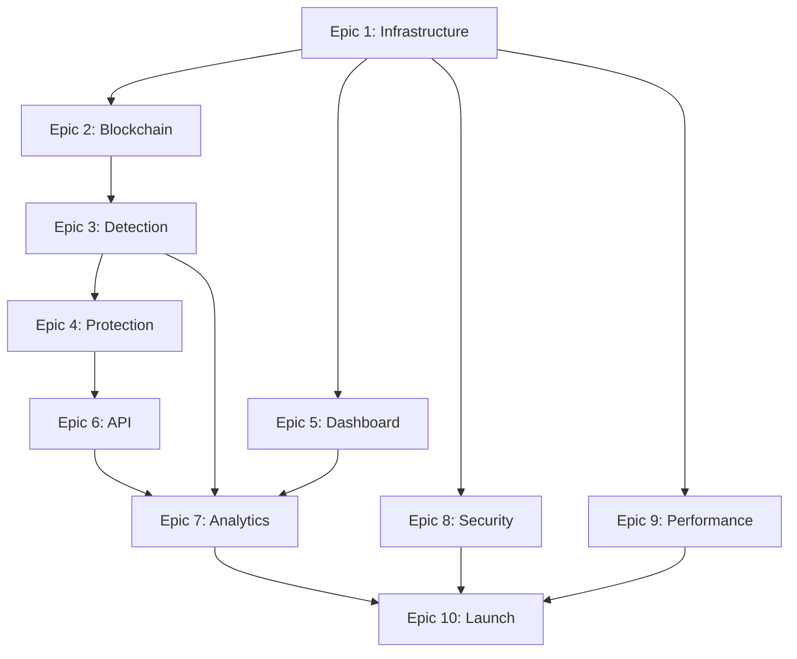

# MEV Shield - Epic Structure & Execution Plan

## Epic Hierarchy Overview

```
MEV Shield Platform
├── Epic 1: Core Infrastructure & Architecture
├── Epic 2: Blockchain Integration Layer
├── Epic 3: MEV Detection Engine
├── Epic 4: Protection & Mitigation System
├── Epic 5: User Experience & Dashboard
├── Epic 6: API & Developer Platform
├── Epic 7: Analytics & Reporting
├── Epic 8: Security & Compliance
├── Epic 9: Performance & Scalability
└── Epic 10: Launch & Operations
```

---

## 🏗️ Epic 1: Core Infrastructure & Architecture
**MEVS-1000** | **Priority: P0** | **Sprint: 1-2** | **Team: DevOps + Backend**

### Objective
Establish robust, scalable infrastructure foundation for MEV Shield platform.

### Key Results
- ✅ Development environment operational
- ✅ CI/CD pipeline automated
- ✅ Database architecture optimized
- ✅ Monitoring & alerting active

### User Stories
| ID | Story | Points | Dependencies |
|---|---|---|---|
| MEVS-1001 | As a developer, I need Docker/K8s environment for consistent deployments | 8 | None |
| MEVS-1002 | As a system architect, I need PostgreSQL schema for MEV data storage | 13 | None |
| MEVS-1003 | As DevOps, I need CI/CD pipelines for automated testing and deployment | 8 | MEVS-1001 |
| MEVS-1004 | As a team lead, I need monitoring with Prometheus/Grafana | 5 | MEVS-1001 |
| MEVS-1005 | As a developer, I need Redis caching layer for performance | 5 | MEVS-1002 |
| MEVS-1006 | As DevOps, I need backup and disaster recovery procedures | 8 | MEVS-1002 |
| MEVS-1007 | As a security engineer, I need secrets management system | 5 | MEVS-1001 |

### Success Metrics
- Infrastructure uptime: 99.9%
- Deploy time: < 5 minutes
- Database query performance: < 100ms p95
- Cache hit rate: > 80%

---

## ⛓️ Epic 2: Blockchain Integration Layer
**MEVS-2000** | **Priority: P0** | **Sprint: 1-3** | **Team: Blockchain**

### Objective
Build multi-chain blockchain connectivity and data ingestion layer.

### Key Results
- ✅ Ethereum mainnet connected
- ✅ Multi-chain support (4+ chains)
- ✅ Real-time mempool access
- ✅ Historical data indexing

### User Stories
| ID | Story | Points | Dependencies |
|---|---|---|---|
| MEVS-2001 | As a user, I need Ethereum mainnet node connectivity | 13 | MEVS-1001 |
| MEVS-2002 | As a user, I need Polygon network integration | 8 | MEVS-2001 |
| MEVS-2003 | As a user, I need BSC network integration | 8 | MEVS-2001 |
| MEVS-2004 | As a user, I need Arbitrum/Optimism L2 support | 13 | MEVS-2001 |
| MEVS-2005 | As a developer, I need mempool streaming service | 13 | MEVS-2001 |
| MEVS-2006 | As an analyst, I need blockchain data indexer | 8 | MEVS-1002 |
| MEVS-2007 | As a user, I need cross-chain transaction tracking | 8 | MEVS-2001-4 |

### Success Metrics
- Block processing latency: < 100ms
- Mempool coverage: > 95%
- Chain sync time: < 1 hour
- Data availability: 99.99%

---

## 🔍 Epic 3: MEV Detection Engine
**MEVS-3000** | **Priority: P0** | **Sprint: 2-4** | **Team: ML + Backend**

### Objective
Develop ML-powered MEV detection system with high accuracy and low latency.

### Key Results
- ✅ Front-running detection operational
- ✅ Sandwich attack detection accurate
- ✅ Novel MEV pattern recognition
- ✅ Real-time alert system

### User Stories
| ID | Story | Points | Dependencies |
|---|---|---|---|
| MEVS-3001 | As a trader, I need front-running detection within 50ms | 21 | MEVS-2005 |
| MEVS-3002 | As a trader, I need sandwich attack pattern recognition | 21 | MEVS-2005 |
| MEVS-3003 | As a trader, I need JIT liquidity attack detection | 13 | MEVS-2005 |
| MEVS-3004 | As a developer, I need ML model training pipeline | 13 | MEVS-1002 |
| MEVS-3005 | As a user, I need real-time MEV alerts via WebSocket | 8 | MEVS-3001-3 |
| MEVS-3006 | As an analyst, I need MEV impact calculator | 8 | MEVS-3001-3 |
| MEVS-3007 | As a developer, I need anomaly detection for new patterns | 13 | MEVS-3004 |

### Success Metrics
- Detection accuracy: > 95%
- False positive rate: < 5%
- Detection latency: < 100ms
- Pattern coverage: 10+ types

---

## 🛡️ Epic 4: Protection & Mitigation System
**MEVS-4000** | **Priority: P0** | **Sprint: 3-5** | **Team: Blockchain + Security**

### Objective
Implement comprehensive MEV protection mechanisms across multiple strategies.

### Key Results
- ✅ Private mempool operational
- ✅ Flashbots integration complete
- ✅ Smart routing engine active
- ✅ Protection success rate > 90%

### User Stories
| ID | Story | Points | Dependencies |
|---|---|---|---|
| MEVS-4001 | As a user, I need private transaction submission | 21 | MEVS-2005 |
| MEVS-4002 | As a user, I need Flashbots Protect integration | 13 | MEVS-4001 |
| MEVS-4003 | As a trader, I need smart order routing | 21 | MEVS-3001 |
| MEVS-4004 | As a user, I need transaction bundling service | 13 | MEVS-4001 |
| MEVS-4005 | As a trader, I need slippage protection | 8 | MEVS-4003 |
| MEVS-4006 | As a user, I need gas optimization engine | 8 | MEVS-4003 |
| MEVS-4007 | As a builder, I need MEV redistribution mechanism | 13 | MEVS-4001 |

### Success Metrics
- Protection success rate: > 90%
- Transaction inclusion time: < 2 blocks
- Gas savings: > 20%
- MEV captured: > $1M/month

---

## 💻 Epic 5: User Experience & Dashboard
**MEVS-5000** | **Priority: P0** | **Sprint: 4-6** | **Team: Frontend + Design**

### Objective
Create intuitive, powerful dashboard for all user types with real-time insights.

### Key Results
- ✅ Web dashboard launched
- ✅ Mobile apps available
- ✅ Wallet integrations complete
- ✅ User satisfaction > 4.5/5

### User Stories
| ID | Story | Points | Dependencies |
|---|---|---|---|
| MEVS-5001 | As a user, I need responsive web dashboard | 21 | MEVS-3005 |
| MEVS-5002 | As a user, I need MetaMask/WalletConnect integration | 13 | MEVS-1004 |
| MEVS-5003 | As a trader, I need portfolio overview with MEV metrics | 13 | MEVS-5001 |
| MEVS-5004 | As a user, I need transaction history with protection status | 8 | MEVS-5001 |
| MEVS-5005 | As a user, I need iOS mobile application | 21 | MEVS-5001 |
| MEVS-5006 | As a user, I need Android mobile application | 21 | MEVS-5001 |
| MEVS-5007 | As a user, I need customizable alerts and notifications | 8 | MEVS-5001 |

### Success Metrics
- Page load time: < 2 seconds
- User retention: > 60% (30-day)
- Daily active users: > 1,000
- Mobile app rating: > 4.5 stars

---

## 🔌 Epic 6: API & Developer Platform
**MEVS-6000** | **Priority: P1** | **Sprint: 5-7** | **Team: Backend**

### Objective
Build comprehensive API platform enabling third-party integrations and developer adoption.

### Key Results
- ✅ REST API v2 launched
- ✅ WebSocket API operational
- ✅ SDKs in 3+ languages
- ✅ Developer adoption > 100 apps

### User Stories
| ID | Story | Points | Dependencies |
|---|---|---|---|
| MEVS-6001 | As a developer, I need comprehensive REST API | 13 | MEVS-3001 |
| MEVS-6002 | As a developer, I need real-time WebSocket API | 13 | MEVS-3005 |
| MEVS-6003 | As a developer, I need JavaScript/TypeScript SDK | 13 | MEVS-6001 |
| MEVS-6004 | As a developer, I need Python SDK | 8 | MEVS-6001 |
| MEVS-6005 | As a developer, I need Go/Rust SDK | 8 | MEVS-6001 |
| MEVS-6006 | As a developer, I need interactive API documentation | 5 | MEVS-6001 |
| MEVS-6007 | As a developer, I need webhook event system | 8 | MEVS-6001 |

### Success Metrics
- API response time: < 200ms p95
- API uptime: > 99.9%
- SDK downloads: > 1,000/month
- Active developers: > 100

---

## 📊 Epic 7: Analytics & Reporting
**MEVS-7000** | **Priority: P1** | **Sprint: 6-8** | **Team: Data + Frontend**

### Objective
Deliver comprehensive analytics platform with actionable insights and reporting.

### Key Results
- ✅ Real-time analytics dashboard
- ✅ Historical MEV analysis
- ✅ Custom report builder
- ✅ ML predictions active

### User Stories
| ID | Story | Points | Dependencies |
|---|---|---|---|
| MEVS-7001 | As an analyst, I need real-time MEV analytics dashboard | 13 | MEVS-5001 |
| MEVS-7002 | As a trader, I need personal MEV impact reports | 8 | MEVS-7001 |
| MEVS-7003 | As an institution, I need custom report builder | 13 | MEVS-7001 |
| MEVS-7004 | As a researcher, I need MEV trend analysis tools | 8 | MEVS-7001 |
| MEVS-7005 | As a trader, I need MEV prediction models | 21 | MEVS-3004 |
| MEVS-7006 | As a user, I need export functionality (CSV/PDF) | 5 | MEVS-7001 |
| MEVS-7007 | As an analyst, I need cross-chain MEV comparison | 8 | MEVS-7001 |

### Success Metrics
- Report generation time: < 5 seconds
- Data accuracy: > 99%
- Prediction accuracy: > 80%
- User engagement: > 30 min/session

---

## 🔐 Epic 8: Security & Compliance
**MEVS-8000** | **Priority: P0** | **Sprint: 7-9** | **Team: Security**

### Objective
Ensure platform security, regulatory compliance, and user data protection.

### Key Results
- ✅ Security audit passed
- ✅ SOC2 compliance achieved
- ✅ GDPR compliant
- ✅ Zero security breaches

### User Stories
| ID | Story | Points | Dependencies |
|---|---|---|---|
| MEVS-8001 | As a CISO, I need comprehensive security audit | 21 | All |
| MEVS-8002 | As a user, I need 2FA/MFA authentication | 8 | MEVS-1004 |
| MEVS-8003 | As compliance, I need GDPR data handling | 13 | MEVS-1002 |
| MEVS-8004 | As security, I need penetration testing | 13 | MEVS-8001 |
| MEVS-8005 | As compliance, I need audit logging system | 8 | MEVS-1002 |
| MEVS-8006 | As security, I need DDoS protection | 8 | MEVS-1001 |
| MEVS-8007 | As a user, I need encrypted data storage | 8 | MEVS-1002 |

### Success Metrics
- Security score: A+ rating
- Compliance audits passed: 100%
- Incident response time: < 15 minutes
- Data breach count: 0

---

## ⚡ Epic 9: Performance & Scalability
**MEVS-9000** | **Priority: P1** | **Sprint: 8-10** | **Team: Backend + DevOps**

### Objective
Optimize platform for high performance and horizontal scalability.

### Key Results
- ✅ 100K+ concurrent users supported
- ✅ Sub-second response times
- ✅ Auto-scaling operational
- ✅ 99.99% uptime achieved

### User Stories
| ID | Story | Points | Dependencies |
|---|---|---|---|
| MEVS-9001 | As DevOps, I need auto-scaling infrastructure | 13 | MEVS-1001 |
| MEVS-9002 | As a developer, I need database query optimization | 13 | MEVS-1002 |
| MEVS-9003 | As DevOps, I need CDN implementation | 8 | MEVS-5001 |
| MEVS-9004 | As a developer, I need caching strategy optimization | 8 | MEVS-1005 |
| MEVS-9005 | As DevOps, I need load balancing configuration | 8 | MEVS-9001 |
| MEVS-9006 | As QA, I need load testing framework | 8 | MEVS-9001 |
| MEVS-9007 | As DevOps, I need performance monitoring dashboard | 5 | MEVS-1004 |

### Success Metrics
- API response time: < 100ms p50
- Page load time: < 1 second
- Concurrent users: > 100K
- Infrastructure cost: < $0.10/user

---

## 🚀 Epic 10: Launch & Operations
**MEVS-10000** | **Priority: P0** | **Sprint: 10-12** | **Team: All**

### Objective
Successfully launch MEV Shield to production with operational excellence.

### Key Results
- ✅ Production launch successful
- ✅ 10K+ users onboarded
- ✅ 24/7 support operational
- ✅ Market leader position

### User Stories
| ID | Story | Points | Dependencies |
|---|---|---|---|
| MEVS-10001 | As product, I need go-to-market strategy | 13 | All |
| MEVS-10002 | As marketing, I need launch campaign materials | 8 | MEVS-10001 |
| MEVS-10003 | As support, I need 24/7 support system | 13 | MEVS-5001 |
| MEVS-10004 | As DevOps, I need production deployment | 13 | All |
| MEVS-10005 | As product, I need user onboarding flow | 8 | MEVS-5001 |
| MEVS-10006 | As support, I need documentation portal | 8 | MEVS-6006 |
| MEVS-10007 | As business, I need billing/subscription system | 13 | MEVS-5001 |

### Success Metrics
- Launch day users: > 1,000
- Month 1 users: > 10,000
- User satisfaction: > 4.5/5
- Revenue: > $50K MRR

---

## 📈 Epic Dependency Map



---

## 🎯 Epic Prioritization Matrix

| Epic | Business Value | Technical Risk | Resource Need | Priority | Quarter |
|------|---------------|----------------|---------------|----------|---------|
| E1: Infrastructure | High | Low | Medium | P0 | Q1 |
| E2: Blockchain | Critical | Medium | High | P0 | Q1 |
| E3: Detection | Critical | High | High | P0 | Q1 |
| E4: Protection | Critical | High | High | P0 | Q1-Q2 |
| E5: Dashboard | High | Low | Medium | P0 | Q1-Q2 |
| E6: API Platform | Medium | Low | Medium | P1 | Q2 |
| E7: Analytics | Medium | Medium | Medium | P1 | Q2 |
| E8: Security | Critical | Medium | Medium | P0 | Q2 |
| E9: Performance | High | Medium | Medium | P1 | Q2 |
| E10: Launch | Critical | Low | High | P0 | Q2 |

---

## 📊 Resource Allocation by Epic

```
Epic 1:  ████░░░░░░ 40% DevOps, 60% Backend
Epic 2:  ██████████ 100% Blockchain Team
Epic 3:  ████████░░ 80% ML, 20% Backend
Epic 4:  █████████░ 90% Blockchain, 10% Security
Epic 5:  ████████░░ 80% Frontend, 20% Design
Epic 6:  ██████████ 100% Backend
Epic 7:  ██████░░░░ 60% Data, 40% Frontend
Epic 8:  ██████████ 100% Security
Epic 9:  ██████░░░░ 60% Backend, 40% DevOps
Epic 10: ████████░░ All Teams
```

---

## 🔄 Epic Execution Phases

### Phase 1: Foundation (Q1 - Weeks 1-6)
- **Focus**: E1 + E2 start + E3 start
- **Goal**: Core infrastructure ready
- **Milestone**: Alpha with basic detection

### Phase 2: Core Features (Q1 - Weeks 7-12)
- **Focus**: E3 complete + E4 + E5 start
- **Goal**: Detection & protection operational
- **Milestone**: Beta with full protection

### Phase 3: Enhancement (Q2 - Weeks 13-18)
- **Focus**: E5 complete + E6 + E7 + E8
- **Goal**: Full platform features
- **Milestone**: Release Candidate

### Phase 4: Scale & Launch (Q2 - Weeks 19-24)
- **Focus**: E9 + E10
- **Goal**: Production ready at scale
- **Milestone**: Public Launch

---

## ✅ Epic Success Criteria

### Definition of Done (DoD) per Epic
1. All user stories completed
2. Unit test coverage > 80%
3. Integration tests passing
4. Security review passed
5. Documentation complete
6. Performance benchmarks met
7. Stakeholder approval received

### Epic Completion Checklist
- [ ] Technical requirements met
- [ ] Success metrics achieved
- [ ] User acceptance testing passed
- [ ] Production deployment ready
- [ ] Monitoring & alerts configured
- [ ] Support documentation created
- [ ] Team handoff completed

---

## 📝 Epic Ownership

| Epic | Epic Owner | Technical Lead | Key Stakeholders |
|------|------------|----------------|------------------|
| E1 | DevOps Manager | Senior DevOps | CTO, Security |
| E2 | Blockchain Lead | Senior Blockchain Eng | Product, CTO |
| E3 | ML Lead | Senior ML Engineer | Product, Data |
| E4 | Blockchain Lead | Senior Security Eng | Product, Security |
| E5 | Frontend Lead | Senior Frontend Eng | Product, Design |
| E6 | Backend Lead | Senior Backend Eng | Developer Relations |
| E7 | Data Lead | Senior Data Engineer | Product, Business |
| E8 | Security Lead | Security Architect | Legal, Compliance |
| E9 | DevOps Manager | Performance Eng | CTO, DevOps |
| E10 | Product Manager | Program Manager | CEO, All Teams |

---

**Document Version**: 2.0
**Last Updated**: 2025-09-20
**Status**: APPROVED FOR EXECUTION
**Total Story Points**: 735
**Estimated Duration**: 24 weeks
**Team Size Required**: 20-25 engineers