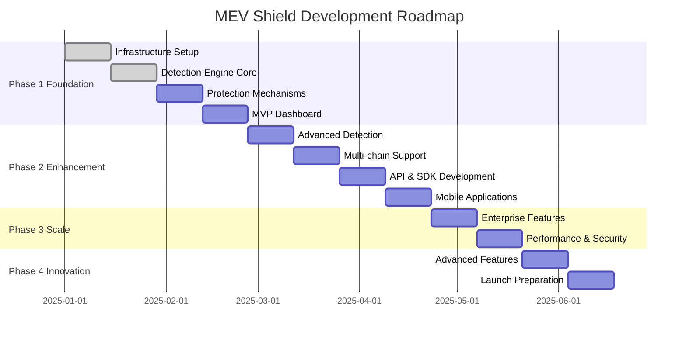

# MEV Shield - Product Roadmap 2025

## Executive Summary
MEV Shield development roadmap covering 6-month journey from MVP to production launch.

---

## Timeline Overview



---

## Q1 2025 (January - March)

### January: Foundation Building 🏗️

#### Week 1-2 (Jan 1-14) - Sprint 1
**Infrastructure Setup**
- ✅ Development environment configuration
- ✅ CI/CD pipeline setup
- ✅ Database architecture
- ✅ Blockchain node infrastructure
- ✅ Authentication service

#### Week 3-4 (Jan 15-28) - Sprint 2
**Detection Engine Core**
- 🔄 Mempool monitoring service
- 🔄 Transaction analysis module
- 🔄 Front-running detection
- 🔄 Sandwich attack detection
- 🔄 Detection API endpoints

### February: Core Features 🎯

#### Week 1-2 (Jan 29 - Feb 11) - Sprint 3
**Protection Mechanisms**
- ⏳ Private transaction pool
- ⏳ Flashbots integration
- ⏳ Transaction routing engine
- ⏳ Protection APIs
- ⏳ Gas optimization

#### Week 3-4 (Feb 12-25) - Sprint 4
**MVP Dashboard**
- ⏳ Dashboard framework
- ⏳ Wallet connection
- ⏳ Portfolio overview
- ⏳ Transaction history
- ⏳ Real-time notifications

**🎉 Alpha Release - End of February**

### March: Enhancement Phase 🚀

#### Week 1-2 (Feb 26 - Mar 11) - Sprint 5
**Advanced Detection**
- ⏳ ML model training
- ⏳ JIT liquidity detection
- ⏳ Cross-DEX arbitrage
- ⏳ Anomaly detection
- ⏳ Accuracy metrics

#### Week 3-4 (Mar 12-25) - Sprint 6
**Multi-chain Support**
- ⏳ Polygon integration
- ⏳ Arbitrum integration
- ⏳ Optimism integration
- ⏳ Cross-chain tracking
- ⏳ Chain-specific rules

---

## Q2 2025 (April - June)

### April: Developer Tools & Mobile 📱

#### Week 1-2 (Mar 26 - Apr 8) - Sprint 7
**API & SDK Development**
- ⏳ REST API v2
- ⏳ WebSocket API
- ⏳ JavaScript SDK
- ⏳ Python SDK
- ⏳ API documentation

#### Week 3-4 (Apr 9-22) - Sprint 8
**Mobile Applications**
- ⏳ React Native setup
- ⏳ iOS application
- ⏳ Android application
- ⏳ Push notifications
- ⏳ Biometric auth

**🎉 Beta Release - End of April**

### May: Scaling & Optimization ⚡

#### Week 1-2 (Apr 23 - May 6) - Sprint 9
**Enterprise Features**
- ⏳ White-label system
- ⏳ Advanced analytics
- ⏳ RBAC implementation
- ⏳ Compliance reporting
- ⏳ SLA monitoring

#### Week 3-4 (May 7-20) - Sprint 10
**Performance & Security**
- ⏳ Performance optimization
- ⏳ Security audit prep
- ⏳ Load testing
- ⏳ Disaster recovery
- ⏳ Rate limiting

**🎉 Release Candidate - Mid May**

### June: Innovation & Launch 🎊

#### Week 1-2 (May 21 - Jun 3) - Sprint 11
**Advanced Features**
- ⏳ AI predictions
- ⏳ MEV redistribution
- ⏳ Social trading
- ⏳ Bridge protection
- ⏳ DAO governance

#### Week 3-4 (Jun 4-17) - Sprint 12
**Launch Preparation**
- ⏳ Production deployment
- ⏳ Marketing website
- ⏳ Documentation portal
- ⏳ Bug fixes
- ⏳ Launch monitoring

**🚀 Production Launch - June 30, 2025**

---

## Key Milestones 🏁

| Date | Milestone | Description | Success Criteria |
|------|-----------|-------------|------------------|
| Feb 28 | Alpha Release | MVP with core features | 100 test users |
| Mar 31 | Multi-chain Live | 4+ chains supported | 500 active users |
| Apr 30 | Beta Release | Full feature set | 1,000 active users |
| May 15 | RC Release | Production ready | Security audit passed |
| Jun 30 | Production Launch | Public availability | 5,000+ users |

---

## Feature Release Schedule

### Core Features (Q1)
- [x] User authentication
- [x] Basic MEV detection
- [ ] Transaction protection
- [ ] Dashboard MVP
- [ ] Ethereum support

### Enhanced Features (Q2)
- [ ] Advanced ML detection
- [ ] Multi-chain support
- [ ] Mobile applications
- [ ] Developer APIs
- [ ] Enterprise features

### Advanced Features (Q3)
- [ ] AI predictions
- [ ] Social trading
- [ ] DAO governance
- [ ] MEV redistribution
- [ ] Cross-chain bridges

---

## Risk Timeline

### High Risk Periods
- **Jan 15-28**: Initial detection engine development
- **Feb 12-25**: User interface complexity
- **Mar 26-Apr 8**: API stability concerns
- **May 7-20**: Security audit findings
- **Jun 4-17**: Launch readiness

### Mitigation Strategies
- Weekly risk assessments
- 20% buffer in timelines
- Parallel development tracks
- Continuous security testing
- Phased rollout strategy

---

## Resource Allocation Timeline

### Q1 2025 Team Size
- **January**: 8 developers
- **February**: 12 developers
- **March**: 15 developers

### Q2 2025 Team Size
- **April**: 18 developers
- **May**: 20 developers
- **June**: 15 developers + support

### Budget Allocation
- **Q1 2025**: $800K
- **Q2 2025**: $1.2M
- **Infrastructure**: $500K/year
- **Security**: $200K
- **Marketing**: $300K

---

## Success Metrics Timeline

### User Growth Targets
```
January:    100 alpha testers
February:   500 active users
March:      1,000 active users
April:      2,500 active users
May:        5,000 active users
June:       10,000+ active users
```

### Revenue Targets
```
Q1 2025: $0 (Free alpha/beta)
Q2 2025: $50K MRR
Q3 2025: $200K MRR
Q4 2025: $500K MRR
```

### Technical Metrics
```
Detection Accuracy: 95%+ by March
API Uptime: 99.9% by May
Response Time: <200ms p95 by June
Transaction Success: 99%+ by launch
```

---

## Communication Plan

### Monthly Updates
- Product newsletter
- Community calls
- Development blog
- Social media updates

### Stakeholder Reviews
- Weekly team standups
- Bi-weekly stakeholder updates
- Monthly board reviews
- Quarterly investor updates

---

## Dependencies & Prerequisites

### External Dependencies
- Flashbots API availability
- Ethereum node reliability
- Third-party wallet support
- Exchange API access
- Security audit scheduling

### Internal Prerequisites
- Team hiring completion
- Infrastructure setup
- Security framework
- Testing framework
- Documentation system

---

## Post-Launch Roadmap (Q3-Q4 2025)

### Q3 2025 Focus
- International expansion
- Advanced AI features
- Institutional features
- Partnership integrations
- Performance optimization

### Q4 2025 Focus
- Cross-chain bridges
- DeFi protocol integrations
- Advanced analytics
- Regulatory compliance
- Market expansion

---

## Conclusion

The MEV Shield roadmap represents an ambitious but achievable plan to deliver industry-leading MEV protection. With proper execution, resource allocation, and risk management, we aim to capture significant market share in the MEV protection space.

### Key Success Factors
1. **Technical Excellence**: Build robust, scalable infrastructure
2. **User Experience**: Simple, intuitive interface
3. **Market Timing**: Launch before competition intensifies
4. **Community Building**: Engage users early and often
5. **Security First**: Maintain highest security standards

---

**Document Version**: 1.0
**Last Updated**: 2025-09-20
**Review Schedule**: Bi-weekly
**Owner**: Product Management Team

---

## Appendix: Sprint Velocity Chart

```
Sprint 1:  ████████░░░░░░░░ 60 points
Sprint 2:  ██████████████░░ 85 points
Sprint 3:  ████████████████ 100 points (target)
Sprint 4:  ████████████████ 100 points (target)
Sprint 5:  ████████████████ 110 points (target)
Sprint 6:  ████████████████ 110 points (target)
Sprint 7:  ████████████████ 120 points (target)
Sprint 8:  ████████████████ 120 points (target)
Sprint 9:  ██████████████░░ 100 points (target)
Sprint 10: ██████████████░░ 95 points (target)
Sprint 11: ████████████░░░░ 90 points (target)
Sprint 12: ████████████░░░░ 85 points (target)
```

Total Planned Story Points: **1,175 points**
Average Velocity Required: **98 points/sprint**